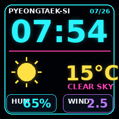
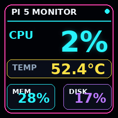
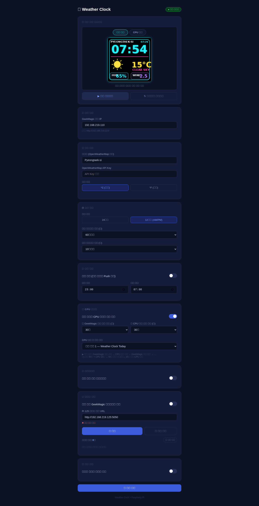

# GeekMagic SmallTV Ultra — Weather Clock & System Monitor

> Raspberry Pi 5와 GeekMagic SmallTV Ultra를 연동하는 날씨 시계 + 시스템 모니터 프로젝트  
> A weather clock and system monitor for GeekMagic SmallTV Ultra, powered by Raspberry Pi 5

---

## 한국어

### 개요

Raspberry Pi 5에서 날씨 정보와 시계를 담은 240×240 이미지를 생성하여 GeekMagic SmallTV Ultra 장치에 실시간으로 푸시하는 앱입니다. 별도의 펌웨어 수정 없이 장치 내장 HTTP API만을 사용합니다.

### 화면 미리보기

큼직한 글씨 위주로 단순화한 현재 디자인입니다. 실제 기기에 표시되는 화면과 동일하게 `/preview` 엔드포인트로 실시간 렌더링한 스크린샷입니다.

| 날씨 + 시계 | CPU 모니터 |
|:---:|:---:|
|  |  |

### 화면 모드

| 모드 | 설명 |
|------|------|
| 날씨+시계 (커스텀) | Pillow로 생성한 날씨·시계 이미지를 장치에 Push |
| GeekMagic 내장 테마 | 장치 자체 날씨/시계 화면 (theme 1~7 선택 가능) |
| CPU 모니터 | CPU 사용률, 메모리, 디스크, CPU 온도, 업타임 표시 |
| 슬라이드쇼 | 로컬 폴더의 사진을 순서대로 반복 표시 |
| 카메라 촬영 슬라이드쇼 | USB 카메라 서버(Pi 125 등)에서 촬영한 사진을 순환 표시 |
| 콘솔 출력 | 셸 명령어 실행 결과를 실시간으로 표시 |

### 표시 우선순위

```
카메라 슬라이드쇼 > 로컬 폴더 슬라이드쇼 > CPU 모니터 ≈ 콘솔 출력 > 날씨+시계
```

### 요구사항

- Raspberry Pi (Python 3.10 이상)
- GeekMagic SmallTV Ultra (펌웨어 Ultra-V9.0.x)
- 같은 로컬 네트워크 환경
- OpenWeatherMap API Key (무료 플랜, 없으면 더미 데이터로 동작)

### 설치

```bash
# 1. 저장소 클론
git clone https://github.com/jongils/GeekMagic-WeatherClock.git
cd GeekMagic-WeatherClock

# 2. 가상환경 생성 및 패키지 설치
python3 -m venv venv
venv/bin/pip install -r requirements.txt

# 3. 설정 파일 생성 (필수 — 아래 항목 참고)
cp config.example.json config.json
nano config.json

# 4. (선택) systemd 서비스 등록 — 부팅 시 자동 시작
bash install.sh
```

> **⚠️ 클론 후 반드시 `config.json`을 수정하세요.**  
> 저장소의 기본값은 플레이스홀더이며, 그대로 실행하면 장치에 연결되지 않습니다.

| 항목 | 기본값 | 수정 내용 |
|------|--------|-----------|
| `device_ip` | `192.168.x.x` | GeekMagic 장치의 실제 IP 주소로 변경 |
| `city` | `Seoul` | 날씨를 조회할 도시명으로 변경 (OpenWeatherMap 기준) |
| `api_key` | `""` | OpenWeatherMap API Key 입력 (없으면 더미 데이터로 동작) |
| `slideshow.folder` | `/home/pi/Pictures` | 슬라이드쇼로 표시할 사진 폴더 경로로 변경 |

장치 IP는 공유기 관리 페이지 또는 `arp -a` 명령으로 확인할 수 있습니다.

### 설정 (`config.json`)

```json
{
  "device_ip": "192.168.x.x",
  "city": "Seoul",
  "api_key": "YOUR_OPENWEATHERMAP_API_KEY",
  "temp_unit": "metric",
  "time_format": "24h",
  "refresh_interval_sec": 60,
  "weather_interval_min": 10,
  "push_timeout_sec": 8,
  "push_retries": 3,
  "web_port": 8080,
  "web_auth": {
    "username": "jongils",
    "password_hash": "scrypt:32768:8:1$..."
  },
  "night_mode": {
    "enabled": false,
    "start": "23:00",
    "end": "07:00"
  },
  "cpu_monitor": {
    "enabled": false,
    "show_sec": 10,
    "rest_sec": 50,
    "restore_theme": 1
  },
  "slideshow": {
    "enabled": false,
    "folder": "/home/pi/Pictures",
    "show_sec": 10,
    "rest_sec": 0,
    "shuffle": false,
    "restore_theme": 1
  },
  "console": {
    "enabled": false,
    "command": "vcgencmd measure_temp && free -h && df -h /",
    "label": "",
    "refresh_sec": 5,
    "show_sec": 30,
    "rest_sec": 0,
    "restore_theme": 1
  },
  "camera": {
    "enabled": false,
    "server_url": "http://192.168.x.x:5050",
    "api_token": "",
    "show_sec": 10,
    "restore_theme": 1
  }
}
```

#### 기본 설정

| 항목 | 설명 | 기본값 |
|------|------|--------|
| `device_ip` | GeekMagic 장치 IP 주소 | — |
| `city` | 날씨 조회 도시명 (OpenWeatherMap 기준) | `Seoul` |
| `api_key` | OpenWeatherMap API Key | `""` (없으면 더미 데이터) |
| `temp_unit` | 온도 단위 `metric`(°C) / `imperial`(°F) | `metric` |
| `time_format` | 시간 형식 `24h` / `12h` | `24h` |
| `refresh_interval_sec` | 날씨 화면 업데이트 주기 (초) | `60` |
| `weather_interval_min` | 날씨 API 호출 주기 (분) | `10` |
| `push_timeout_sec` | 장치 Push 요청 타임아웃 (초) | `8` |
| `push_retries` | Push 실패 시 재시도 횟수 | `3` |
| `web_port` | 웹 설정 UI 포트 | `8080` |
| `web_auth` | 웹 UI/API HTTP Basic 인증 계정 | — (필수) |
| `night_mode.enabled` | 야간 모드 (지정 시간대 Push 중단) | `false` |

#### CPU 모니터 (`cpu_monitor`)

| 항목 | 설명 | 기본값 |
|------|------|--------|
| `enabled` | CPU 모니터 교대 표시 활성화 | `false` |
| `show_sec` | CPU 정보 표시 시간 (초) | `10` |
| `rest_sec` | GeekMagic 내장 테마 표시 시간 (초) | `50` |
| `restore_theme` | CPU 종료 후 복원할 내장 테마 번호 (0=날씨 커스텀) | `1` |

#### 슬라이드쇼 (`slideshow`)

| 항목 | 설명 | 기본값 |
|------|------|--------|
| `enabled` | 슬라이드쇼 활성화 | `false` |
| `folder` | 사진 폴더 경로 | `/home/pi/Pictures` |
| `show_sec` | 사진 1장 표시 시간 (초) | `10` |
| `rest_sec` | 사진 사이 내장 테마 표시 시간 (0=연속 재생) | `0` |
| `shuffle` | 랜덤 순서 재생 | `false` |
| `restore_theme` | 사진 사이 복원할 내장 테마 번호 | `1` |

#### 콘솔 출력 (`console`)

| 항목 | 설명 | 기본값 |
|------|------|--------|
| `enabled` | 콘솔 출력 표시 활성화 | `false` |
| `command` | 실행할 셸 명령어 | Pi 상태 조회 명령 |
| `label` | 타이틀 바 텍스트 (비워두면 명령어 앞부분 표시) | `""` |
| `refresh_sec` | 연속 모드: 명령 재실행 주기 (초) | `5` |
| `show_sec` | 교대 모드: 콘솔 표시 시간 (초) | `30` |
| `rest_sec` | 0=연속 표시, N=교대 표시 (내장 테마 표시 시간) | `0` |
| `restore_theme` | 교대 모드 종료 후 복원할 내장 테마 번호 | `1` |

#### 카메라 촬영 슬라이드쇼 (`camera`)

별도의 USB 카메라 서버(예: 다른 Raspberry Pi + `camera_server/`)가 촬영한 사진을 주기적으로 가져와 장치에 슬라이드쇼로 표시합니다. 일반 폴더 슬라이드쇼보다 우선 표시됩니다.

| 항목 | 설명 | 기본값 |
|------|------|--------|
| `enabled` | 카메라 슬라이드쇼 활성화 | `false` |
| `server_url` | 카메라 서버 주소 (`http://IP:PORT`) | — |
| `api_token` | 카메라 서버 인증 토큰 (`CAMERA_API_TOKEN`과 동일 값) | — |
| `show_sec` | 사진 1장 표시 시간 (초) | `10` |
| `restore_theme` | 슬라이드쇼 종료 후 복원할 내장 테마 번호 | `1` |

### 실행

**메인 서비스**
```bash
venv/bin/python3 main.py
```
웹 설정 UI: `http://[라즈베리파이 IP]:8080`

#### 웹 설정 UI로 접속하기

같은 네트워크의 브라우저에서 위 주소로 접속하면 아래와 같은 설정 화면이 나옵니다. 최초 접속 시 브라우저가 HTTP Basic 인증 로그인 창을 띄우며, `config.json`의 `web_auth`에 설정한 아이디/비밀번호를 입력해야 페이지가 열립니다.



화면 상단의 미리보기 카드는 `/preview` API로 현재 코드 기준 날씨+시계·CPU 화면을 즉시 렌더링해 보여주며, 이후 IP/도시/온도 단위 등 기본 설정, 야간 모드, CPU 모니터·슬라이드쇼·카메라·콘솔 출력 각 기능의 토글과 세부 옵션이 이어집니다. 값을 바꾸고 맨 아래 저장 버튼을 누르면 즉시 반영됩니다.

웹 UI와 API는 HTTP Basic 인증을 요구합니다. 비밀번호는 평문으로 저장하지 않고, `config.json`에는 [werkzeug](https://pypi.org/project/Werkzeug/)의 `generate_password_hash`로 생성한 솔트 포함 해시(scrypt)만 저장합니다.

동봉된 `hash_password.py`로 해시 값을 생성해 `config.json`에 붙여넣으세요.

```bash
venv/bin/python3 hash_password.py
비밀번호 입력: (화면에 표시되지 않음)
scrypt:32768:8:1$....
```

```json
"web_auth": {
  "username": "jongils",
  "password_hash": "scrypt:32768:8:1$..."
}
```

> 기존에 평문 `password` 값으로 되어 있던 `config.json`도 그대로 동작합니다 — 서버가 첫 요청 시 자동으로 해시로 변환해 저장하고 평문 값은 삭제합니다.

콘솔 화면은 보안을 위해 `src/console_image.py`의 `ALLOWED_COMMANDS`에 등록된 명령만 실행하며, 셸 문자열을 직접 실행하지 않습니다.

카메라 서버는 `CAMERA_API_TOKEN` 환경변수와 클라이언트의 `camera.api_token` 값이 같아야 합니다. `camera_server/install.sh` 실행 시 토큰을 입력하고, 동일한 값을 메인 장치의 `config.json`에 설정하세요.

모든 기능(슬라이드쇼, CPU 모니터, 콘솔 출력)은 웹 UI 또는 `config.json`으로 켜고 끌 수 있습니다.

| 동작 | 반영 시점 |
|------|-----------|
| 기능 **켜기** (토글 ON) | 설정 저장 즉시 스레드 시작 |
| 기능 **끄기** (토글 OFF) | 최대 1초 이내 스레드 종료 + 화면 자동 복원 |
| 숫자·문자열 설정 변경 | 다음 사이클 시작 시 자동 반영 (재시작 불필요) |

기능을 끄면 해당 스레드가 즉시 종료되고, `restore_theme`에 설정된 내장 테마(또는 날씨+시계 화면)로 장치 화면이 자동으로 복원됩니다.

> **주의 1**: `main.py`가 실행 중일 때 `cpu_monitor.py`를 별도로 실행하면 두 프로세스가 장치 테마를 서로 덮어써 충돌이 발생합니다. CPU 모니터는 반드시 `main.py` 내 통합 스케줄러를 사용하세요.

> **주의 2 (코드 변경 후 반드시 재시작)**: `config.json` 설정 값은 실시간 반영되지만, `src/*.py` 또는 `templates/index.html` 파일을 직접 수정한 경우에는 서비스를 재시작해야 변경 사항이 적용됩니다. Python 모듈은 서비스 기동 시 메모리에 로드되며 이후 파일이 바뀌어도 자동으로 다시 읽지 않습니다. (Flask 템플릿은 요청마다 디스크에서 읽으나, Python 코드는 재시작 필수)
> ```bash
> sudo systemctl restart weather-clock
> ```

**CPU 모니터 standalone (main.py 미실행 시 전용)**
```bash
venv/bin/python3 cpu_monitor.py
```
CPU 정보 표시 → 장치 내장 테마 복원 → 반복 / 종료: `Ctrl+C`

### 프로젝트 구조

```
├── main.py                  # 메인 진입점 (통합 스케줄러)
├── cpu_monitor.py           # CPU 모니터 standalone (main.py 미실행 시 전용)
├── config.json              # 설정 파일
├── requirements.txt
├── install.sh               # systemd 서비스 등록 스크립트
├── hash_password.py         # web_auth.password_hash 값 생성 도구
├── src/
│   ├── weather_api.py       # OpenWeatherMap API 연동
│   ├── image_generator.py   # Pillow 날씨+시계 이미지 생성
│   ├── cpu_image.py         # Pillow CPU 모니터 이미지 생성
│   ├── slideshow.py         # 슬라이드쇼 이미지 처리 (리사이즈·EXIF·캐시)
│   ├── console_image.py     # 명령어 출력 → 240×240 이미지 렌더링
│   ├── camera_client.py     # 카메라 서버 HTTP 클라이언트 (촬영·다운로드)
│   ├── push_client.py       # GeekMagic HTTP API 클라이언트
│   ├── scheduler.py         # 멀티스레드 스케줄러 (표시 우선순위 조율)
│   └── web_config.py        # Flask 웹 설정 서버
├── camera_server/           # (별도 Pi에서 실행) USB 카메라 캡처 서버
│   ├── camera_server.py
│   └── install.sh
├── templates/
│   └── index.html           # 웹 설정 UI
├── docs/screenshots/         # README용 스크린샷
└── cache/
    ├── current.jpg          # 현재 날씨+시계 이미지
    ├── cpu_current.jpg      # 현재 CPU 모니터 이미지
    ├── slideshow/           # 슬라이드쇼 처리 이미지 캐시
    ├── camera_feed/         # 카메라 슬라이드쇼 다운로드 캐시
    └── console/             # 콘솔 출력 이미지 캐시
```

### 아키텍처

```
main.py
  ├── [scheduler thread]    날씨+시계 이미지 → Push (매 N초)
  │     └─ 슬라이드쇼·콘솔·CPU·카메라 표시 중이면 자동 skip
  ├── [cpu-monitor thread]  내장 테마(rest_sec) → CPU Push(show_sec) → 테마 복원 → 반복
  ├── [slideshow thread]    사진 리사이즈 → Push(show_sec) → [테마(rest_sec)] → 반복
  ├── [camera thread]       카메라 서버에서 사진 다운로드 → Push(show_sec) → 반복
  ├── [console thread]      명령 실행 → 이미지 Push → 대기 → 반복
  │     연속 모드: refresh_sec마다 갱신 / 교대 모드: 내장 테마 → 콘솔 → 반복
  └── [Flask thread]        웹 설정 UI (포트 8080)

모든 Push는 threading.Lock(_push_lock)으로 동시 실행 방지
```

### 장치 HTTP API

| 엔드포인트 | 설명 |
|-----------|------|
| `POST /doUpload?dir=/image/` | 이미지 업로드 (multipart/form-data) |
| `GET /set?theme=N` | 테마 전환 (3=포토앨범, 1·2·4~7=내장 테마) |
| `GET /set?img=/image//파일명` | 표시 이미지 지정 (theme=3 상태에서만 유효) |
| `GET /app.json` | 현재 테마 조회 |
| `GET /img.json` | 현재 표시 이미지 경로 조회 |
| `GET /v.json` | 펌웨어 버전 조회 |

> **주의 1**: `requests` 라이브러리는 ESP8266의 `Content-Length` 중복 헤더 버그로 사용 불가. `http.client`를 직접 사용합니다.  
> **주의 2**: `/set?theme=3&img=...` 조합 쿼리는 ESP8266 펌웨어가 `img=`를 무시합니다. 이미지 업로드 → 테마 전환 → 이미지 지정을 반드시 **별도 3단계 요청**으로 분리해야 합니다.

### 웹 설정 UI 엔드포인트

| 경로 | 설명 |
|------|------|
| `GET /` | 설정 메인 페이지 |
| `POST /config` | 설정 저장 |
| `GET /status` | 장치 연결 상태 + 현재 시각 JSON |
| `GET /push-now` | 날씨+시계 화면 즉시 업데이트 |
| `GET /preview?type=weather\|cpu` | 현재 코드로 날씨+시계 또는 CPU 화면을 즉시 렌더링해 미리보기 |
| `GET /slideshow-info?folder=` | 지정 폴더의 이미지 수 반환 |
| `GET /console-preview?command=&label=` | 명령어 실행 결과 이미지 즉시 생성 반환 |
| `GET /camera/status` | 카메라 서버 연결 상태 + 저장된 사진 수 |
| `POST /camera/capture` | 카메라 서버에 촬영 명령 전달 |
| `GET /camera/photos` | 카메라로 촬영한 사진 목록 |
| `GET /camera/photo/<파일명>` | 촬영된 사진 파일 반환 |
| `DELETE /camera/delete/<파일명>` | 촬영된 사진 1장 삭제 |
| `DELETE /camera/delete-all` | 촬영된 사진 전체 삭제 |

---

## English

### Overview

This project pushes real-time weather, clock, CPU stats, slideshows, camera-captured photos, and console output as 240×240 images to a GeekMagic SmallTV Ultra display from a Raspberry Pi 5. It uses only the device's built-in HTTP API — no firmware modification required.

### Screenshots

Current display design — large, high-legibility text on a minimal neon frame. These are live screenshots rendered from the running code via the `/preview` endpoint.

| Weather + Clock | CPU Monitor |
|:---:|:---:|
|  |  |

### Display Modes

| Mode | Content |
|------|---------|
| Weather + Clock (custom) | Pillow-rendered weather and clock image pushed to device |
| GeekMagic Built-in Theme | Device's own weather/clock display (selectable theme 1–7) |
| CPU Monitor | CPU usage, memory, disk, temperature, uptime |
| Slideshow | Cycles through photos from a local folder |
| Camera Capture Slideshow | Cycles through photos captured by a USB camera server (e.g. another Pi) |
| Console Output | Renders shell command output as a live display |

### Display Priority

```
Camera Slideshow > Local Slideshow > CPU Monitor ≈ Console > Weather + Clock
```

### Requirements

- Raspberry Pi (Python 3.10+)
- GeekMagic SmallTV Ultra (firmware Ultra-V9.0.x)
- Same local network
- OpenWeatherMap API Key (free tier; falls back to dummy data if not provided)

### Installation

```bash
# 1. Clone the repository
git clone https://github.com/jongils/GeekMagic-WeatherClock.git
cd GeekMagic-WeatherClock

# 2. Create virtual environment and install dependencies
python3 -m venv venv
venv/bin/pip install -r requirements.txt

# 3. Create configuration file (required — see table below)
cp config.example.json config.json
nano config.json

# 4. (Optional) Register as systemd service for auto-start on boot
bash install.sh
```

> **⚠️ You must edit `config.json` after cloning.**  
> The repository ships with placeholder values — the service will not connect to your device until these are set.

| Key | Default | What to set |
|-----|---------|-------------|
| `device_ip` | `192.168.x.x` | Your GeekMagic device's actual IP address |
| `city` | `Seoul` | City name for weather lookup (OpenWeatherMap format) |
| `api_key` | `""` | Your OpenWeatherMap API Key (optional; falls back to dummy data) |
| `slideshow.folder` | `/home/pi/Pictures` | Path to your photo folder for slideshow |

To find your device IP, check your router's admin page or run `arp -a`.

### Configuration (`config.json`)

#### Core Settings

| Key | Description | Default |
|-----|-------------|---------|
| `device_ip` | GeekMagic device IP address | — |
| `city` | City name for weather (OpenWeatherMap format) | `Seoul` |
| `api_key` | OpenWeatherMap API Key | `""` (uses dummy data if empty) |
| `temp_unit` | Temperature unit: `metric` (°C) or `imperial` (°F) | `metric` |
| `time_format` | Clock format: `24h` or `12h` | `24h` |
| `refresh_interval_sec` | Display update interval (seconds) | `60` |
| `weather_interval_min` | Weather API fetch interval (minutes) | `10` |
| `push_timeout_sec` | Device push request timeout (seconds) | `8` |
| `push_retries` | Retry attempts on push failure | `3` |
| `web_port` | Web config UI port | `8080` |
| `web_auth` | HTTP Basic auth credentials for the web UI/API | — (required) |
| `night_mode.enabled` | Suppress pushes during specified hours | `false` |

#### CPU Monitor (`cpu_monitor`)

| Key | Description | Default |
|-----|-------------|---------|
| `enabled` | Enable alternating CPU monitor display | `false` |
| `show_sec` | Duration to show CPU screen (seconds) | `10` |
| `rest_sec` | Duration to show GeekMagic built-in theme (seconds) | `50` |
| `restore_theme` | Built-in theme number to restore after CPU (0 = custom weather) | `1` |

#### Slideshow (`slideshow`)

| Key | Description | Default |
|-----|-------------|---------|
| `enabled` | Enable slideshow | `false` |
| `folder` | Path to photo folder | `/home/pi/Pictures` |
| `show_sec` | Duration to show each photo (seconds) | `10` |
| `rest_sec` | Built-in theme display time between photos (0 = continuous) | `0` |
| `shuffle` | Randomize photo order | `false` |
| `restore_theme` | Built-in theme number to show between photos | `1` |

#### Console Output (`console`)

| Key | Description | Default |
|-----|-------------|---------|
| `enabled` | Enable console output display | `false` |
| `command` | Shell command to execute | Pi status command |
| `label` | Title bar text (omit to show command prefix) | `""` |
| `refresh_sec` | Continuous mode: re-run interval (seconds) | `5` |
| `show_sec` | Alternating mode: console display duration (seconds) | `30` |
| `rest_sec` | 0 = continuous display; N = alternating (theme duration in seconds) | `0` |
| `restore_theme` | Built-in theme number to restore after console (alternating mode) | `1` |

#### Camera Capture Slideshow (`camera`)

Periodically pulls photos from a separate USB camera server (e.g. another Raspberry Pi running `camera_server/`) and displays them as a slideshow. Takes priority over the local-folder slideshow.

| Key | Description | Default |
|-----|-------------|---------|
| `enabled` | Enable camera slideshow | `false` |
| `server_url` | Camera server address (`http://IP:PORT`) | — |
| `api_token` | Camera server auth token (must match `CAMERA_API_TOKEN`) | — |
| `show_sec` | Duration to show each photo (seconds) | `10` |
| `restore_theme` | Built-in theme number to restore after slideshow | `1` |

### Usage

**Main service**
```bash
venv/bin/python3 main.py
```
Web config UI: `http://[raspberry-pi-ip]:8080`

#### Accessing the web config UI

Open the address above from a browser on the same network to see the settings page below. On first visit, the browser prompts for HTTP Basic auth — enter the username/password configured in `web_auth` in `config.json` to unlock the page.


The preview card at the top renders the current weather+clock and CPU screens live via the `/preview` API, followed by core settings (IP, city, units), night mode, and toggles/options for CPU monitor, slideshow, camera, and console output. Changes take effect immediately after saving at the bottom.

The web UI and APIs require HTTP Basic authentication configured through `web_auth` in `config.json`. Passwords are never stored in plaintext — `config.json` only holds a salted hash (scrypt) generated by [werkzeug](https://pypi.org/project/Werkzeug/)'s `generate_password_hash`.

Generate the hash with the bundled `hash_password.py` and paste it into `config.json`:

```bash
venv/bin/python3 hash_password.py
Password: (hidden input)
scrypt:32768:8:1$....
```

```json
"web_auth": {
  "username": "jongils",
  "password_hash": "scrypt:32768:8:1$..."
}
```

> A `config.json` with an older plaintext `password` field still works — the server hashes it automatically on the first request and removes the plaintext value.

Console rendering only executes commands explicitly registered in `src/console_image.py`'s `ALLOWED_COMMANDS`; arbitrary shell strings are rejected.

The camera server requires `CAMERA_API_TOKEN`. It must match `camera.api_token` in the main service's `config.json`; `camera_server/install.sh` prompts for it during installation.

All features (slideshow, CPU monitor, console output) can be toggled via the web UI or `config.json`.

| Action | When it takes effect |
|--------|---------------------|
| **Enable** a feature (toggle ON) | Thread starts immediately on save |
| **Disable** a feature (toggle OFF) | Thread stops within 1 second + display auto-restored |
| Change numeric/string settings | Applied at the start of the next cycle (no restart needed) |

When a feature is disabled, its thread exits immediately and the device display is automatically restored to the configured `restore_theme` (built-in theme or custom weather screen).

> **Warning 1**: Running `cpu_monitor.py` while `main.py` is active causes a race condition — both processes fight over the device theme. Use the integrated scheduler in `main.py` instead.

> **Warning 2 (restart required after code changes)**: While `config.json` values are reloaded at runtime, any changes to `src/*.py` or `templates/index.html` require a service restart to take effect. Python modules are loaded into memory at startup and are not reloaded automatically when files change on disk. (Flask templates are re-read per request, but Python code is not.)
> ```bash
> sudo systemctl restart weather-clock
> ```

**CPU Monitor standalone (only when main.py is NOT running)**
```bash
venv/bin/python3 cpu_monitor.py
```
Cycles: CPU stats → built-in theme → repeat / Stop with `Ctrl+C`

### Project Structure

```
├── main.py                  # Entry point (integrated multi-thread scheduler)
├── cpu_monitor.py           # Standalone CPU monitor (use only without main.py)
├── config.json              # Configuration file
├── requirements.txt
├── install.sh               # systemd service registration script
├── hash_password.py         # Tool to generate web_auth.password_hash
├── src/
│   ├── weather_api.py       # OpenWeatherMap API integration
│   ├── image_generator.py   # Pillow weather+clock image renderer
│   ├── cpu_image.py         # Pillow CPU monitor image renderer
│   ├── slideshow.py         # Slideshow image processing (resize, EXIF, cache)
│   ├── console_image.py     # Shell command output → 240×240 image renderer
│   ├── camera_client.py     # HTTP client for the camera server (capture/download)
│   ├── push_client.py       # GeekMagic HTTP API client
│   ├── scheduler.py         # Multi-thread scheduler (display priority coordination)
│   └── web_config.py        # Flask web config server
├── camera_server/           # (runs on a separate Pi) USB camera capture server
│   ├── camera_server.py
│   └── install.sh
├── templates/
│   └── index.html           # Web config UI
├── docs/screenshots/         # Screenshots used in this README
└── cache/
    ├── current.jpg          # Current weather+clock image
    ├── cpu_current.jpg      # Current CPU monitor image
    ├── slideshow/           # Processed slideshow image cache
    ├── camera_feed/         # Downloaded camera slideshow cache
    └── console/             # Console output image cache
```

### Architecture

```
main.py
  ├── [scheduler thread]    Weather image → Push every N seconds
  │     └─ Skipped when slideshow/console/CPU/camera is displaying
  ├── [cpu-monitor thread]  Built-in theme(rest_sec) → CPU Push(show_sec) → restore → repeat
  ├── [slideshow thread]    Resize photo → Push(show_sec) → [theme(rest_sec)] → repeat
  ├── [camera thread]       Download photo from camera server → Push(show_sec) → repeat
  ├── [console thread]      Run command → render image → Push → wait → repeat
  │     Continuous: refresh every N sec / Alternating: theme → console → repeat
  └── [Flask thread]        Web config UI (port 8080)

All pushes are serialized via threading.Lock (_push_lock)
```

### Key Device API Endpoints

| Endpoint | Description |
|----------|-------------|
| `POST /doUpload?dir=/image/` | Upload image (multipart/form-data) |
| `GET /set?theme=N` | Switch theme (3=photo album, 1·2·4–7=built-in) |
| `GET /set?img=/image//filename` | Set display image (only valid in theme=3) |
| `GET /app.json` | Query current theme |
| `GET /img.json` | Query current display image path |
| `GET /v.json` | Query firmware version |

> **Note 1**: The `requests` library cannot be used due to an ESP8266 firmware bug that sends duplicate `Content-Length` headers. This project uses `http.client` directly.  
> **Note 2**: `/set?theme=3&img=...` combined query — the ESP8266 firmware silently ignores the `img=` parameter. Always send as **three separate requests**: upload → `set?theme=3` → `set?img=`.

### Web Config UI Endpoints

| Path | Description |
|------|-------------|
| `GET /` | Settings main page |
| `POST /config` | Save settings |
| `GET /status` | Device connection status + current time (JSON) |
| `GET /push-now` | Force an immediate weather+clock update |
| `GET /preview?type=weather\|cpu` | Instantly render a live preview of the weather+clock or CPU screen from current code |
| `GET /slideshow-info?folder=` | Return the photo count for a given folder |
| `GET /console-preview?command=&label=` | Instantly render and return a preview of a command's output |
| `GET /camera/status` | Camera server connection status + saved photo count |
| `POST /camera/capture` | Trigger a capture on the camera server |
| `GET /camera/photos` | List captured photos |
| `GET /camera/photo/<filename>` | Return a captured photo file |
| `DELETE /camera/delete/<filename>` | Delete one captured photo |
| `DELETE /camera/delete-all` | Delete all captured photos |

### Known Limitations

- External images can only be displayed in Photo Album mode (`theme=3`)
- The device always references `weather_clock.jpg` internally — the filename cannot be changed
- `img.json` periodically resets to the internal saved path; the file content itself must be overwritten

### License

MIT

---

*Last updated: 2026-07-26*
