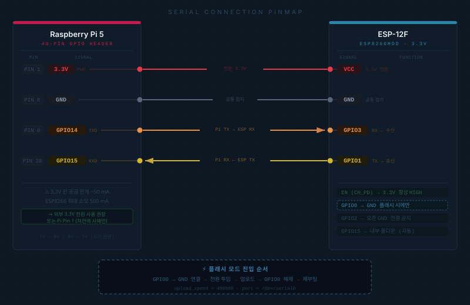

# 개발 환경 구축 가이드

---

## 개발 호스트 환경

| 항목 | 내용 |
|------|------|
| 호스트 | Raspberry Pi 5 Model B |
| OS | Raspberry Pi OS (Debian 12, aarch64) |
| Python | 3.13 |
| PlatformIO Core | 6.1.19 |
| Arduino 프레임워크 | `espressif8266 @ 4.2.1` |

> macOS / Linux PC에서도 동일하게 동작합니다.

---

## 1. 필수 소프트웨어 설치

### Python 3

```bash
sudo apt update
sudo apt install python3 python3-pip python3-venv
```

### PlatformIO Core

```bash
curl -fsSL https://raw.githubusercontent.com/platformio/platformio-core-installer/master/get-platformio.py \
  -o get-platformio.py
python3 get-platformio.py
```

PATH 등록:

```bash
echo 'export PATH="$HOME/.platformio/penv/bin:$PATH"' >> ~/.bashrc
source ~/.bashrc
pio --version   # PlatformIO Core, version 6.x.x
```

### Pi 쪽 Python 패키지 (draw_client용)

```bash
pip3 install requests
```

---

## 2. Raspberry Pi UART 설정

GPIO 하드웨어 UART를 ESP8266 시리얼 플래시에 사용합니다.

### 2-1. UART 활성화

`/boot/firmware/config.txt`에 추가:

```
enable_uart=1
```

### 2-2. 시리얼 콘솔 비활성화 확인

`/boot/firmware/cmdline.txt`에 `console=serial0,115200`이 **없어야** 합니다.

올바른 예:
```
console=tty1 root=PARTUUID=xxxxxxxx rootfstype=ext4 fsck.repair=yes rootwait
```

### 2-3. dialout 그룹 추가

```bash
sudo usermod -aG dialout $USER
# 재로그인 후 적용
groups   # dialout 포함 확인
```

### 2-4. 시리얼 장치 확인

```bash
ls -la /dev/serial0
# lrwxrwxrwx ... /dev/serial0 -> ttyAMA0
```

---

## 3. 하드웨어 연결 (Pi ↔ ESP8266)



### GeekMagic SmallTV Ultra 시리얼 커넥터 (6핀)

보드에 노출된 프로그래밍 패드의 물리 핀 순서입니다.

| 핀 # | 신호 | 용도 |
|------|------|------|
| 1 | **GND** | 공통 접지 |
| 2 | **TX** | ESP8266 송신 → Pi RX |
| 3 | **RX** | ESP8266 수신 ← Pi TX |
| 4 | **VCC** | 3.3V 전원 입력 |
| 5 | **GPIO0** | GND 단락 시 플래시 모드 진입 |
| 6 | **RST** | 리셋 (선택, 보통 오픈) |

> PIN 1 위치는 보드 실크 또는 엣지 마킹으로 확인하세요.

### Pi ↔ 보드 배선

| Raspberry Pi 5 | 보드 핀 # | 신호 |
|----------------|-----------|------|
| Pin 6  (GND)         | **PIN 1** | GND |
| Pin 10 (GPIO15 / RXD) | **PIN 2** | TX → Pi RX |
| Pin 8  (GPIO14 / TXD) | **PIN 3** | RX ← Pi TX |
| 외부 3.3V 전원        | **PIN 4** | VCC |

> TX↔RX 교차 연결. Pi 3.3V Pin 1(~50 mA)로는 전류 부족할 수 있으므로 외부 전원 권장.

### 플래시 모드 진입

PIN 5 (GPIO0) → PIN 1 (GND) 단락 상태로 전원 투입 시 부트로더 진입.

```
보드 PIN 5 (GPIO0) ─┐
보드 PIN 1 (GND)   ─┘  (점퍼 또는 핀셋으로 단락)
```

### 배선 다이어그램

```
Raspberry Pi 5              GeekMagic Board (6-pin)
                            ┌──────────────┐
                            │ 1  GND       │◄──── Pi Pin 6  (GND)
                            │ 2  TX        │────► Pi Pin 10 (GPIO15 RXD)
Pi Pin 8  (GPIO14 TXD) ───► │ 3  RX        │
Pi Pin 1  (3.3V) ─────────► │ 4  VCC       │
                            │ 5  GPIO0 ──┐ │  ← 플래시 시 GND와 단락
                            │ 1  GND  ───┘ │
                            │ 6  RST       │  ← 오픈 (사용 안 함)
                            └──────────────┘
```

> **WiFi 연결 후에는 OTA(`/update`)로 업데이트**하므로 시리얼 연결은 최초 1회만 필요합니다.

---

## 4. 저장소 클론 및 빌드

```bash
git clone https://github.com/jongils/GeekMagic-Customization.git
cd GeekMagic-Customization/firmware

pio run -e esp8266
```

첫 빌드 시 PlatformIO가 자동 설치하는 라이브러리:

| 라이브러리 | 버전 | 용도 |
|------------|------|------|
| Bodmer/TFT_eSPI | ^2.5.43 | ST7789V 드라이버 |
| bblanchon/ArduinoJson | ^7.3.1 | JSON 파싱 (드로잉 커맨드) |
| bitbank2/JPEGDEC | ^1.2.9 | JPEG 디코딩 |
| arduino-libraries/NTPClient | ^3.2.1 | NTP 시각 동기 |
| tzapu/WiFiManager | ^2.0.17 | 첫 실행 AP 모드 WiFi 설정 |

---

## 5. 펌웨어 플래시 (시리얼)

```
1. ESP8266 GPIO0 → GND 연결
2. ESP8266 전원 투입 (플래시 모드)
3. pio run 실행
4. 업로드 완료 후 GPIO0 → GND 해제
5. 전원 재투입 → 정상 부팅
```

```bash
pio run -e esp8266 -t upload --upload-port /dev/serial0
```

> `upload_speed = 460800` 고정. 921600은 타임아웃 발생.

---

## 6. OTA 업데이트 (WiFi)

WiFi 연결 후에는 시리얼 없이 업데이트 가능합니다.

```bash
# 빌드
pio run -e esp8266

# OTA 업로드
curl -F "image=@.pio/build/esp8266/firmware.bin" http://<장치IP>/update
```

`platformio.ini`의 `[env:esp8266_ota]` 환경도 사용 가능:

```bash
pio run -e esp8266_ota -t upload
```

---

## 7. 시리얼 모니터

```bash
pio device monitor --port /dev/serial0 --baud 115200
```

> 모니터가 열려 있으면 동일 포트로 플래시 불가.  
> 플래시 전 반드시 종료(`Ctrl+C`).
>
> 백그라운드 프로세스가 점유 중이면:
> ```bash
> fuser /dev/serial0   # PID 확인
> kill <PID>
> ```

---

## 8. 프로젝트 구조

```
firmware/
├── platformio.ini
├── src/
│   ├── main.cpp             ← 진입점 (모드 기반 렌더링 루프)
│   ├── config.h             ← 전역 상수
│   ├── display.cpp/.h       ← TFT 래퍼 (모든 그리기 함수)
│   ├── draw_cmd.cpp/.h      ← JSON 드로잉 커맨드 파서
│   ├── http_server.cpp/.h   ← HTTP API + 모드 관리
│   ├── filesystem.cpp/.h    ← LittleFS
│   ├── jpeg_display.cpp/.h  ← JPEG 스트리밍
│   └── clock_theme.cpp/.h   ← 기본 디지털 시계
└── diag/
    └── main.cpp             ← 핀 탐색 진단 (별도 env)

pi/
└── draw_client.py           ← Pi쪽 HTTP 클라이언트
```

### 빌드 환경

| 환경 이름 | 용도 |
|-----------|------|
| `esp8266` | 빌드 + 시리얼 플래시 |
| `esp8266_ota` | 빌드 + WiFi OTA |
| `esp8266_diag` | 핀 진단 펌웨어 (`diag/` 소스) |

---

## 9. 자주 발생하는 문제

| 증상 | 원인 | 해결 |
|------|------|------|
| `Timed out waiting for packet header` | 업로드 속도 너무 높음 | `upload_speed = 460800` 확인 |
| `device reports readiness to read but returned no data` | 시리얼 포트 점유 중 | `fuser /dev/serial0` 후 kill |
| 업로드 후 화면 없음 | GPIO0 GND 해제 후 재부팅 안 함 | 선 제거 후 전원 재투입 |
| WiFi 연결 안 됨 | 저장된 SSID 없음 | `GeekMagic-Setup` AP 접속 후 설정 |
| `/update` OTA 실패 | espota 프로토콜 시도 | `curl -F "image=@..."` 사용 |
| 한글 텍스트 깨짐 | TFT_eSPI 내장 폰트 ASCII 전용 | 영문·숫자만 사용 |
